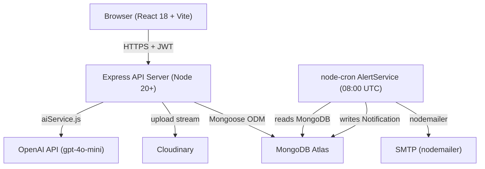
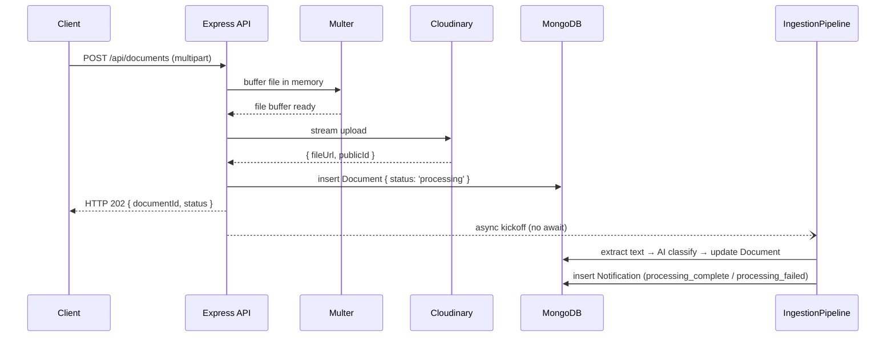
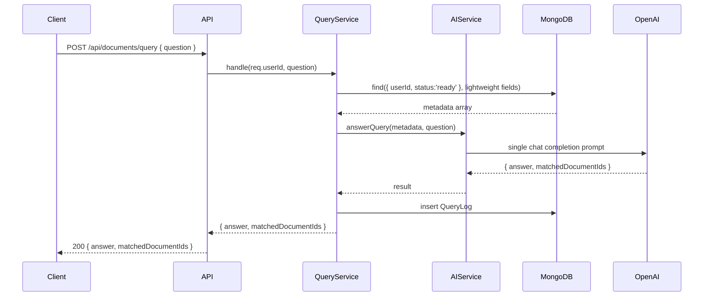

# Design Document — Docket

## Overview

Docket is a full-stack personal document intelligence vault. Users upload PDFs and images; an async ingestion pipeline extracts text and uses an LLM to classify each document and pull out structured fields (type, issuer, dates, amount). The resulting metadata powers three user-facing capabilities:

1. **Browse & Search** — a paginated library with type/tag filter chips and a debounced MongoDB `$text` keyword search.
2. **AI Query Bar** — natural-language questions answered by passing the user's full document-metadata set in a single prompt (no vector DB, no RAG).
3. **Proactive Alerts** — a daily cron job that checks expiry dates and sends email + in-app notifications at the 30-day, 7-day, and 1-day thresholds.

The system is built on a React 18 + Vite frontend, a Node.js/Express backend, MongoDB Atlas, Cloudinary for file storage, and the OpenAI API for all AI operations. All AI calls are centralized through `server/services/aiService.js`.

---

## Architecture

### High-Level Component Diagram



### Request Lifecycle — Document Upload



### Request Lifecycle — AI Query



---

## Components and Interfaces

### Backend Services

#### `authService` (inline in controllers)
- `register(name, email, password)` → `{ token, user }`
- `login(email, password)` → `{ token, user }`
- `getMe(userId)` → `{ name, email }`

Password hashing: bcryptjs with cost factor 12.

JWT: signed with `process.env.JWT_SECRET`, `expiresIn: '7d'`.

#### `aiService.js` — the only file that imports the OpenAI SDK

```js
// Public interface
extractDocumentData(extractedText: string): Promise<ExtractionResult>
answerQuery(metadataArray: DocumentMeta[], question: string): Promise<QueryResult>
extractTextFromImage(fileUrl: string): Promise<string>
```

`ExtractionResult`:
```ts
{
  documentType: 'id' | 'certificate' | 'contract' | 'invoice' | 'insurance' | 'warranty' | 'other'
  issuer: string | null
  issueDate: string | null   // YYYY-MM-DD
  expiryDate: string | null  // YYYY-MM-DD
  amount: number | null
  suggestedTitle: string
}
```

`QueryResult`:
```ts
{
  answer: string
  matchedDocumentIds: string[]
}
```

`DocumentMeta` (subset passed to query prompt):
```ts
{
  _id: string
  title: string
  documentType: string
  issuer: string | null
  issueDate: string | null
  expiryDate: string | null
  amount: number | null
  tags: string[]
}
```

Prompt strategy: structured system prompt + JSON-mode response for `extractDocumentData`. Free-text response with JSON footer for `answerQuery`. Retry logic for extraction is handled by `IngestionPipeline`, not `aiService`.

#### `pdfService.js`
```js
extractText(fileBuffer: Buffer): Promise<string>
```
Uses `pdf-parse`. Returns `''` if no text layer found (caller treats empty string as failure per Req 5.5).

#### `cloudinaryService.js`
```js
uploadStream(buffer: Buffer, options): Promise<{ fileUrl, publicId }>
deleteFile(publicId: string): Promise<void>
```

#### `emailService.js`
```js
sendExpiryAlert(to: string, document: DocumentSummary, daysLeft: number): Promise<void>
```

#### `alertService` (jobs/alertJob.js — executed by node-cron)

Algorithm:
1. Find all Documents where `status = 'ready'` AND `expiryDate` is within 0–30 days from today UTC.
2. For each document, compute `daysLeft = differenceInCalendarDays(expiryDate, today)`.
3. Determine applicable thresholds: `30day` if `daysLeft <= 30`, `7day` if `daysLeft <= 7`, `1day` if `daysLeft <= 1`.
4. For each applicable threshold not already in `doc.alertsSent`, send email + create Notification, then push the threshold into `alertsSent`.
5. Errors are caught per-document; processing continues.

Schedule: `cron.schedule('0 8 * * *', alertJob, { timezone: 'UTC' })`.

### Frontend Stores (Zustand)

#### `authStore`
```ts
{
  token: string | null
  user: { name: string; email: string } | null
  isAuthenticated: boolean
  login(token, user): void
  logout(): void
}
```
On store init, reads token from `localStorage`. If token is present but decoded expiry is in the past, calls `logout()`.

#### `notificationStore`
```ts
{
  unreadCount: number
  setUnreadCount(n: number): void
  decrement(): void
  reset(): void
}
```

### Frontend API Layer (`client/src/api/`)

All Axios calls share a single Axios instance (`apiClient`) with a request interceptor that attaches the Bearer token from `authStore` and a response interceptor that calls `authStore.logout()` on HTTP 401.

```ts
// documentsApi.ts
upload(formData: FormData, onUploadProgress): Promise<{ documentId, status }>
list(params): Promise<PaginatedDocuments>
search(query, type?, tag?): Promise<Document[]>
get(id): Promise<Document>
update(id, fields): Promise<Document>
remove(id): Promise<void>
retry(id): Promise<{ status }>
query(question: string): Promise<{ answer, matchedDocumentIds }>

// notificationsApi.ts
list(unreadOnly?): Promise<Notification[]>
markRead(id): Promise<Notification>
markAllRead(): Promise<{ updatedCount }>

// authApi.ts
register(name, email, password): Promise<AuthResponse>
login(email, password): Promise<AuthResponse>
me(): Promise<User>
```

### Frontend Pages and Key Components

| Route | Page Component | Key Responsibilities |
|---|---|---|
| `/login` | `Login` | Form, validation, authStore update, redirect |
| `/register` | `Register` | Form, validation, authStore update, redirect |
| `/dashboard` | `Dashboard` | Stats widget, chart, expiring-soon list, AI query bar |
| `/documents` | `DocumentsLibrary` | Grid/list toggle, filter chips, search bar, pagination |
| `/documents/:id` | `DocumentDetail` | Preview panel, fields form, PATCH on save, delete/retry |
| `/notifications` | `Notifications` | List with type filter, mark-read actions |
| `/settings` | `Settings` | Profile, password, theme, account deletion |

Notable shared components:
- `AiQueryBar` — renders on Dashboard; uses 500-char limit, empty-string guard, 30s timeout, loading spinner.
- `NotificationBell` — reads `notificationStore.unreadCount`; badge hidden when count is 0.
- `ExpiryBadge` — colour-coded pill (red ≤ 7 days, amber ≤ 30 days, green otherwise).
- `UploadDropzone` — react-dropzone with client-side MIME and size validation; shows upload progress bar.
- `LoadingSkeleton` — shape-matched placeholders for document cards, notification items, detail panel.

---

## Data Models

All models live in `server/models/`. Validation is enforced at the Mongoose schema level.

### User

```js
{
  name:         { type: String, required: true, trim: true, maxlength: 100 },
  email:        { type: String, required: true, unique: true, lowercase: true, trim: true },
  passwordHash: { type: String, required: true },
  createdAt:    { type: Date, default: Date.now }
}
```

### Document

```js
{
  userId:           { type: ObjectId, ref: 'User', required: true, index: true },
  title:            { type: String, required: true, trim: true },
  originalFilename: { type: String, required: true },
  fileUrl:          { type: String, required: true },
  fileType:         { type: String, enum: ['pdf', 'image'], required: true },
  extractedText:    { type: String, default: '' },
  documentType:     {
                      type: String,
                      enum: ['id','certificate','contract','invoice','insurance','warranty','other'],
                      default: 'other'
                    },
  issuer:           { type: String, default: null },
  issueDate:        { type: Date, default: null },
  expiryDate:       { type: Date, default: null },
  amount:           { type: Number, default: null },
  tags:             [{ type: String, trim: true }],
  status:           { type: String, enum: ['processing','ready','failed'], default: 'processing' },
  failureReason:    { type: String, default: null },
  alertsSent:       [{ type: String, enum: ['30day','7day','1day'] }],
  reviewedByUser:   { type: Boolean, default: false },
  createdAt:        { type: Date, default: Date.now },
  updatedAt:        { type: Date, default: Date.now }
}
```

Indexes:
- `{ userId: 1, expiryDate: 1 }` — supports AlertService query.
- `{ title: 'text', extractedText: 'text', issuer: 'text' }` — supports `$text` search.

`updatedAt` is set via a `pre('save')` hook and manually on `findOneAndUpdate` calls.

### Notification

```js
{
  userId:     { type: ObjectId, ref: 'User', required: true, index: true },
  documentId: { type: ObjectId, ref: 'Document', default: null },
  message:    { type: String, required: true },
  type:       { type: String, enum: ['expiry_alert','processing_complete','processing_failed'], required: true },
  read:       { type: Boolean, default: false },
  createdAt:  { type: Date, default: Date.now }
}
```

### QueryLog

```js
{
  userId:              { type: ObjectId, ref: 'User', required: true, index: true },
  questionText:        { type: String, required: true },
  answerText:          { type: String, required: true },
  matchedDocumentIds:  [{ type: ObjectId, ref: 'Document' }],
  createdAt:           { type: Date, default: Date.now }
}
```

### Immutable Fields on PATCH `/api/documents/:id`

The following fields are blocked from client updates and are stripped in the controller before `findOneAndUpdate`:
`userId`, `status`, `createdAt`, `failureReason`, `originalFilename`, `fileUrl`, `fileType`, `extractedText`, `alertsSent`, `reviewedByUser` (except via dedicated review-banner dismiss flow).

---

## Correctness Properties

*A property is a characteristic or behavior that should hold true across all valid executions of a system — essentially, a formal statement about what the system should do. Properties serve as the bridge between human-readable specifications and machine-verifiable correctness guarantees.*

---

### Property 1: Registration stores a hash, never the plaintext password

*For any* valid name, email, and password submitted to `/api/auth/register`, the resulting User record stored in the database SHALL have a `passwordHash` field that is not equal to the submitted plaintext password, and the plaintext password SHALL NOT appear anywhere in the stored record.

**Validates: Requirements 1.1, 1.4**

---

### Property 2: Email is always stored in lowercase

*For any* email address submitted to `/api/auth/register`, regardless of the case supplied (e.g., `User@Example.COM`), the `email` field stored on the User record SHALL equal `email.toLowerCase()`.

**Validates: Requirements 1.5**

---

### Property 3: Duplicate email registration is rejected

*For any* email address that is already registered, a subsequent POST to `/api/auth/register` using that same email address — in any casing — SHALL return HTTP 409 and SHALL NOT create a new User record.

**Validates: Requirements 1.2**

---

### Property 4: Invalid registration inputs return HTTP 400

*For any* registration request with at least one invalid field — empty/missing name, malformed email address, or password shorter than 8 characters — the AuthService SHALL return HTTP 400 and SHALL NOT create a User record.

**Validates: Requirements 1.3**

---

### Property 5: Auth round-trip — register, login, and /me return consistent user data

*For any* successfully registered user, calling `POST /api/auth/login` with the same credentials SHALL return a JWT whose decoded payload has an expiry exactly 7 days from issuance, and calling `GET /api/auth/me` with that JWT SHALL return a response whose `name` and `email` fields match the values supplied at registration.

**Validates: Requirements 2.1, 2.3**

---

### Property 6: Invalid login credentials return generic HTTP 401

*For any* login attempt using an unregistered email address, or using a registered email with a non-matching password, the AuthService SHALL return HTTP 401 with a single generic error message that does not distinguish between an unknown email and a wrong password.

**Validates: Requirements 2.2**

---

### Property 7: Auth middleware rejects all invalid JWTs before handler execution

*For any* request to a protected route carrying a missing, malformed, or expired JWT, the Server SHALL return HTTP 401 and SHALL NOT execute any route handler logic or perform any database operation.

**Validates: Requirements 2.4, 15.4**

---

### Property 8: Client attaches Bearer token to every outbound authenticated request

*For any* API call made by the Client while an authenticated session is active, the outbound HTTP request SHALL include an `Authorization: Bearer <token>` header carrying the current session token from the auth store.

**Validates: Requirements 3.4**

---

### Property 9: Unauthenticated access to protected routes redirects to /login

*For any* protected client-side route (`/dashboard`, `/documents`, `/notifications`, `/settings`), navigating to it while the auth store contains no valid JWT SHALL redirect the user to `/login` without rendering the protected page content.

**Validates: Requirements 3.3**

---

### Property 10: Unsupported MIME types are rejected with HTTP 415

*For any* file whose MIME type is not `application/pdf`, `image/jpeg`, `image/png`, or `image/webp`, a POST to `/api/documents` SHALL return HTTP 415 containing the rejected MIME type in the error message, and SHALL NOT create a Document record or store any file.

**Validates: Requirements 4.3**

---

### Property 11: Valid upload creates a Document in Processing State scoped to the authenticated user

*For any* valid file (supported MIME type, ≤ 15 MB) uploaded by an authenticated user, the Server SHALL create a Document record with `status: 'processing'` and `userId` equal to the authenticated user's identity derived from the JWT, and SHALL return HTTP 202 with that document's identifier before any AI processing begins.

**Validates: Requirements 4.4**

---

### Property 12: PDF text extraction returns a non-empty string for text-bearing PDFs

*For any* PDF file that contains a parseable text layer, `pdfService.extractText` SHALL return a non-empty string. An empty result SHALL cause the IngestionPipeline to transition the Document to Failed State.

**Validates: Requirements 5.1, 5.5**

---

### Property 13: Extraction failure produces a descriptive failureReason and a processing_failed Notification

*For any* document where the IngestionPipeline encounters an error during text extraction or AI classification, the Document SHALL transition to Failed State with a non-empty `failureReason` that identifies both the step that failed and the underlying cause, and a `processing_failed` Notification SHALL be created for the document owner.

**Validates: Requirements 5.4**

---

### Property 14: Valid AI extraction result updates all document fields and transitions to Ready State

*For any* document in Processing State for which the AIService returns a response that passes schema validation, the IngestionPipeline SHALL update the Document's `documentType`, `issuer`, `issueDate`, `expiryDate`, `amount`, and `title` fields, set `status` to `'ready'`, and create a `processing_complete` Notification for the owner.

**Validates: Requirements 6.2**

---

### Property 15: documentType values outside the allowed enum are treated as schema failures

*For any* AI response that contains a `documentType` value not in `{ id, certificate, contract, invoice, insurance, warranty, other }`, the IngestionPipeline SHALL treat the response as a schema validation failure and proceed with its retry-then-fail logic.

**Validates: Requirements 6.5**

---

### Property 16: Document list is scoped to the authenticated user and sorted by creation date descending

*For any* authenticated user, a GET request to `/api/documents` SHALL return only Documents whose `userId` matches the authenticated user's identity, sorted by `createdAt` descending, with no more than 50 documents per page.

**Validates: Requirements 7.1, 15.2**

---

### Property 17: Active document filter chips display only matching documents

*For any* set of active type or tag filter chips on the document library page, every document card rendered SHALL match at least one of the selected filter values; documents that match none of the active filters SHALL NOT be displayed.

**Validates: Requirements 7.3**

---

### Property 18: PATCH on a document updates only specified updatable fields; protected fields are immutable

*For any* PATCH request to `/api/documents/:id` with any subset of updatable fields (`title`, `issuer`, `issueDate`, `expiryDate`, `amount`, `tags`), the Server SHALL update exactly those fields, leave all other fields unchanged, and SHALL NOT modify `userId`, `status`, `createdAt`, or `failureReason`.

**Validates: Requirements 8.3**

---

### Property 19: DELETE removes the document only for the owner; retry resets status to Processing

*For any* document owned by user A, a DELETE request by user A SHALL return HTTP 204 and the document SHALL no longer be retrievable. A DELETE request by any other authenticated user SHALL return HTTP 404. A POST to `/api/documents/:id/retry` by the owner SHALL reset the document's `status` to `'processing'` and re-trigger the IngestionPipeline.

**Validates: Requirements 8.7, 8.9**

---

### Property 20: Full-text search returns only the authenticated user's matching documents

*For any* authenticated user and any query string of at least 2 characters, the SearchService SHALL return only Documents that (a) belong to the authenticated user and (b) contain matching terms in the `title`, `extractedText`, or `issuer` fields.

**Validates: Requirements 9.2, 15.2**

---

### Property 21: Type filter restricts search results to the specified documentType

*For any* search request that includes a `type` filter parameter, every Document in the response SHALL have `documentType` equal to the specified filter value.

**Validates: Requirements 9.3**

---

### Property 22: Combined type + tag filter returns only documents satisfying both constraints

*For any* search request with both a `type` filter and a `tag` filter active simultaneously, every Document in the response SHALL have `documentType` matching the type filter AND SHALL include the specified tag in its `tags` array.

**Validates: Requirements 9.4**

---

### Property 23: Search debounce fires exactly one request per 300 ms idle window

*For any* typing sequence in the search input, the Client SHALL send at most one search request per 300 ms idle period, and any keystroke arriving within 300 ms of the previous one SHALL reset the timer without sending a request.

**Validates: Requirements 9.7**

---

### Property 24: QueryService passes only the authenticated user's Ready documents to the AI prompt

*For any* user query, the metadata array passed to `AIService.answerQuery` SHALL contain only lightweight metadata for Documents with `userId` equal to the requesting user's identity and `status` equal to `'ready'` — no documents from any other user SHALL be included.

**Validates: Requirements 10.1, 10.2, 15.5**

---

### Property 25: QueryService creates a QueryLog for every answered query

*For any* question submitted by an authenticated user that receives an answer from the AIService, the QueryService SHALL create a QueryLog record with the correct `userId`, `questionText`, `answerText`, and `matchedDocumentIds`.

**Validates: Requirements 10.5**

---

### Property 26: Client rejects empty or whitespace-only AI query submissions

*For any* string composed entirely of whitespace characters, or an empty string, the Client query bar SHALL reject submission and display an inline validation message, and SHALL NOT send a request to `/api/documents/query`.

**Validates: Requirements 10.8**

---

### Property 27: AlertService identifies documents with expiryDate within 0–30 calendar days

*For any* UTC date on which the AlertService runs, it SHALL identify all Documents with `status: 'ready'` whose `expiryDate` falls between 0 and 30 calendar days from that date (inclusive), and SHALL ignore all others.

**Validates: Requirements 11.2**

---

### Property 28: AlertService sends each threshold alert exactly once per document

*For any* document with an applicable expiry threshold, the AlertService SHALL send an alert email and create a Notification the first time that threshold is evaluated as applicable, record the threshold in `alertsSent`, and SHALL NOT send another alert for that same threshold on any subsequent run.

**Validates: Requirements 11.3, 11.4**

---

### Property 29: AlertService failure on one document does not interrupt processing of the rest

*For any* batch of documents processed by the AlertService where one or more documents cause an error during email send or Notification creation, the AlertService SHALL log the error and continue processing the remaining documents in the batch without interruption.

**Validates: Requirements 11.5**

---

### Property 30: Notification list is scoped to the authenticated user and sorted by creation date descending

*For any* authenticated user, a GET request to `/api/notifications` SHALL return only Notifications where `userId` matches the authenticated user's identity, sorted by `createdAt` descending. When `unreadOnly=true` is supplied, the response SHALL include only Notifications where `read` is `false`.

**Validates: Requirements 12.1**

---

### Property 31: Mark-as-read operations respect ownership

*For any* Notification owned by user A, a PATCH to `/api/notifications/:id/read` by user A SHALL set `read` to `true` and return the updated record. The same request made by any other authenticated user SHALL return HTTP 404 and leave the Notification unchanged.

**Validates: Requirements 12.2**

---

### Property 32: mark-all-read sets all unread notifications to read for the authenticated user

*For any* authenticated user with N unread Notifications, a PATCH to `/api/notifications/mark-all-read` SHALL set `read` to `true` on all N of their Notifications and return a response containing the count N. Notifications belonging to other users SHALL be unaffected.

**Validates: Requirements 12.3**

---

### Property 33: Notification bell badge count matches the unread notification count

*For any* count of unread Notifications N, the bell badge SHALL display N when N > 0 and SHALL NOT display a badge when N = 0.

**Validates: Requirements 12.4**

---

### Property 34: Notification type filter displays only notifications of the selected type

*For any* active type filter on the notifications page, every Notification item rendered SHALL have a `type` field equal to the selected filter value; notifications of other types SHALL NOT be displayed.

**Validates: Requirements 12.5**

---

### Property 35: Dashboard stats endpoint returns all required fields scoped to the authenticated user

*For any* authenticated user, a GET to `/api/dashboard/stats` SHALL return a JSON object containing: `totalCount`, per-status counts, `expiringCount` (within 30 days), `unreadNotificationCount`, per-type counts, and `recentDocuments` (up to 5), all derived exclusively from data belonging to that user.

**Validates: Requirements 13.6**

---

### Property 36: Expiring-soon widget displays at most 10 documents sorted by expiryDate ascending

*For any* set of documents with expiry dates within 30 days, the expiring-soon dashboard widget SHALL render at most 10 of them, sorted by `expiryDate` ascending.

**Validates: Requirements 13.3**

---

### Property 37: Recent-activity list shows exactly 5 most recently created or updated documents

*For any* set of documents belonging to the authenticated user, the recent-activity list SHALL display exactly the 5 documents with the latest `max(createdAt, updatedAt)` value, sorted by that date descending.

**Validates: Requirements 13.4**

---

### Property 38: Password change verifies the current password hash before updating

*For any* password change request where the supplied `currentPassword` does not match the stored bcrypt hash, the Server SHALL return HTTP 401 and SHALL NOT update the stored `passwordHash`. When the `currentPassword` does match and the new password is at least 8 characters, the Server SHALL update the hash and return HTTP 200.

**Validates: Requirements 14.3**

---

### Property 39: Account deletion removes all associated data for the authenticated user

*For any* user with associated Documents, Notifications, and QueryLogs, confirming account deletion SHALL remove the User record and all Documents, Notifications, and QueryLogs where `userId` matches that user's identity — no records belonging to other users SHALL be deleted.

**Validates: Requirements 14.6**

---

### Property 40: Server uses only the JWT-derived userId for all database operations; client-supplied userId is ignored

*For any* request that includes a `userId` field in the request body or query parameters that differs from the `userId` encoded in the verified JWT, the Server SHALL perform all database operations using the JWT-derived `userId` exclusively, and the client-supplied value SHALL have no effect on query results.

**Validates: Requirements 15.1**

---

### Property 41: Cross-user resource access returns HTTP 404

*For any* resource (Document, Notification, or QueryLog) belonging to user A, a request made by authenticated user B to access, modify, or delete that resource SHALL return HTTP 404. The response SHALL NOT be HTTP 403 (to avoid revealing resource existence) and SHALL NOT return the resource data.

**Validates: Requirements 15.3, 8.1, 8.4**

---

## Error Handling

### HTTP Status Code Conventions

| Scenario | Status Code |
|---|---|
| Missing / invalid request field | 400 |
| Missing / invalid / expired JWT | 401 |
| Incorrect current password | 401 |
| Wrong-owner resource access | 404 |
| Email already registered | 409 |
| File too large (> 15 MB) | 413 |
| Unsupported MIME type | 415 |
| External service failure (Cloudinary, OpenAI) | 500 |
| Resource deleted successfully | 204 |
| Async operation accepted | 202 |

### IngestionPipeline Error Strategy

The pipeline runs fully async after HTTP 202 is returned. All errors are caught at the pipeline level, not propagated to the HTTP response. The pipeline follows this error boundary model:

```
uploadFile()       ─ failure → HTTP 500, no Document created (handled before 202)
createDocument()   ─ success → HTTP 202 returned, pipeline begins async
extractText()      ─ failure → failureReason = "PDF parsing: <cause>" or "vision API call: <cause>"
                             → status = 'failed', create processing_failed Notification, stop
emptyText check    ─ failure → failureReason = "No extractable text found in document"
                             → status = 'failed', create processing_failed Notification, stop
aiExtract()        ─ schema invalid on attempt 1 → retry once
                   ─ schema invalid on attempt 2 → failureReason = "AI extraction returned invalid data after retry"
                                                 → status = 'failed', create processing_failed Notification
                   ─ success → update Document fields, status = 'ready', create processing_complete Notification
```

### AlertService Error Strategy

The AlertService wraps each document's processing in a try/catch. A failure for document N is:
1. Logged with the document ID, threshold, and error message.
2. Does not update `alertsSent` for that threshold (to allow retry on next run).
3. Does not interrupt processing of documents N+1, N+2, etc.

### Client-Side Error Handling

All Axios error responses are handled by:
1. A response interceptor that intercepts HTTP 401 globally → clears auth state, redirects to `/login`.
2. Per-request `.catch()` blocks in each API function that return typed error objects.
3. React components use a `hasError` state flag to render error banners with retry buttons.
4. `react-hot-toast` for transient errors (e.g., save failed, copy failed).

### Validation Strategy

- **Server-side**: All inputs validated in controller middleware before reaching service layer. Express middleware `express-validator` or manual checks used consistently.
- **Client-side**: Forms validate fields before submission (MIME type, file size, field presence, password length, email format). Prevents unnecessary network round-trips.
- Both layers validate — client validation is for UX, server validation is the security gate.

---

## Testing Strategy

### Philosophy

Two complementary test layers:
- **Property-based tests**: Verify universal invariants hold across all inputs using randomized generation. These catch edge cases that hand-crafted examples miss.
- **Unit / integration tests**: Verify specific examples, concrete flows, and error conditions. Focused on critical paths and error branches.

Property-based tests run a minimum of 100 iterations each. Unit/integration tests use representative examples.

### Property-Based Testing

**Library**: [fast-check](https://github.com/dubzzz/fast-check) (JavaScript/TypeScript, integrates with Vitest/Jest)

**Test runner**: Vitest (matches the Vite-based frontend; also used for backend Node.js tests)

Each property test is tagged with a comment referencing its design property:

```js
// Feature: docket, Property 1: Registration stores a hash, never the plaintext password
test.prop([fc.string({ minLength: 1, maxLength: 100 }), fc.emailAddress(), fc.string({ minLength: 8 })])
  ('passwordHash is never equal to plaintext password', async (name, email, password) => {
    const { user } = await authService.register(name, email, password);
    expect(user.passwordHash).not.toBe(password);
    expect(user.passwordHash.startsWith('$2b$')).toBe(true); // bcrypt hash prefix
  });
```

**Properties covered by property tests** (corresponding to Correctness Properties 1–41):

| Property | Component | Arbitraries |
|---|---|---|
| 1: Hash stored, not plaintext | `authService.register` | `fc.string` (name), `fc.emailAddress()`, `fc.string(≥8)` |
| 2: Email stored lowercase | `authService.register` | Mixed-case email strings |
| 3: Duplicate email returns 409 | `authService.register` | Registered emails, case variants |
| 4: Invalid inputs return 400 | `authService.register` | Invalid field combinations |
| 5: Auth round-trip (register→login→/me) | Full auth flow | Valid credentials |
| 6: Invalid login returns generic 401 | `authService.login` | Unregistered emails, wrong passwords |
| 7: Auth middleware rejects invalid JWTs | `authMiddleware` | Malformed, expired, missing tokens |
| 8: Bearer token attached to all requests | Axios interceptor | Any API call during auth session |
| 9: Unauthenticated routes redirect | React Router guards | All protected routes |
| 10: Unsupported MIME rejected with 415 | Upload controller | MIME type strings outside allowed set |
| 11: Valid upload creates Processing document | Upload controller | Valid file buffers, MIME types |
| 12: PDF extraction returns non-empty string | `pdfService` | PDF buffers with text layer |
| 13: Extraction failure produces failureReason + Notification | `ingestionPipeline` | Simulated extraction errors |
| 14: Valid AI response transitions to Ready | `ingestionPipeline` | Valid `ExtractionResult` objects |
| 15: Invalid documentType is schema failure | AI response validator | documentType strings outside enum |
| 16: Document list scoped to user, sorted descending | `documentsController.list` | Multiple users, many documents |
| 17: Active filter chips hide non-matching docs | `DocumentsLibrary` component | Filter chip states, doc sets |
| 18: PATCH updates only specified updatable fields | `documentsController.update` | Partial update payloads |
| 19: DELETE / retry ownership enforcement | `documentsController` | Owner vs non-owner requests |
| 20: Search scoped to user's matching docs | `searchService` | Query strings, user docs |
| 21: Type filter restricts search results | `searchService` | documentType filters |
| 22: Combined type+tag filter intersection | `searchService` | Compound filter inputs |
| 23: Debounce fires one request per idle window | `useDebounce` hook | Keystroke sequences with timing |
| 24: QueryService passes only user's Ready docs to AI | `queryService` | Multi-user document sets |
| 25: QueryLog created for every answered query | `queryService` | Any valid question string |
| 26: Client rejects whitespace/empty queries | `AiQueryBar` component | Whitespace strings, empty string |
| 27: AlertService identifies 0–30 day documents | `alertJob` | Document sets with various expiry dates |
| 28: Each threshold alert sent exactly once | `alertJob` | Documents at each threshold boundary |
| 29: AlertService failure isolation | `alertJob` | Batch with one failing document |
| 30: Notification list scoped to user, sorted | `notificationsController.list` | Multi-user notification sets |
| 31: Mark-read respects ownership | `notificationsController` | Owner vs non-owner |
| 32: mark-all-read sets all user's unread to read | `notificationsController` | Users with N unread notifications |
| 33: Bell badge matches unread count | `NotificationBell` component | Unread count values including 0 |
| 34: Notification type filter | `Notifications` page | Type filter states |
| 35: Dashboard stats scoped to user | `dashboardController` | Multi-user data |
| 36: Expiring-soon widget max 10, sorted asc | `Dashboard` component | Document sets with expiry dates |
| 37: Recent-activity shows 5 sorted by latest date | `Dashboard` component | Document sets with creation/update dates |
| 38: Password change verifies hash | `settingsController` | Current/new password pairs |
| 39: Account deletion cascade | `settingsController` | Users with associated data |
| 40: JWT userId used, client userId ignored | `authMiddleware` + all controllers | Requests with mismatched userId fields |
| 41: Cross-user access returns 404 | All resource controllers | Resource IDs and user pairs |

### Unit and Integration Tests

**Unit tests** (Vitest, fast-check where noted):

- `pdfService.extractText`: encrypted PDF, empty PDF, valid PDF with text
- `aiService.extractDocumentData`: valid response parsing, partial response, all-null fields
- `aiService.answerQuery`: prompt construction includes only supplied metadata
- `cloudinaryService`: upload stream success, upload failure propagation
- `emailService.sendExpiryAlert`: template rendering for each threshold (30d, 7d, 1d)
- `authMiddleware`: valid JWT, expired JWT, malformed JWT, missing header
- `UploadDropzone`: file too large (client-side rejection), unsupported MIME (client-side rejection)
- `AiQueryBar`: character limit enforcement, empty/whitespace rejection
- `useDebounce` hook: timing verification

**Integration tests** (Vitest + supertest for API layer, MongoDB in-memory via `mongodb-memory-server`):

- Full registration → login → `/me` flow
- Full upload → poll → ready flow (AI and Cloudinary mocked)
- Full upload → poll → failed flow (AI returns invalid data twice)
- Retry flow: failed document → POST retry → status resets to processing
- AlertService full run: documents at each threshold, duplicate prevention, error isolation
- Account deletion: all associated records removed, no cross-user contamination
- Search: `$text` index query returns correct results; type and tag filters combine correctly

**Smoke tests** (single execution, environment verification):

- MongoDB full-text index exists on Document collection (`{ title, extractedText, issuer }`)
- `node-cron` schedule expression evaluates to `0 8 * * *` (08:00 UTC daily)
- Cloudinary credentials present and connection established
- OpenAI API key present and model accessible

### Test Configuration

```js
// vitest.config.ts
export default defineConfig({
  test: {
    environment: 'node',         // backend tests
    globals: true,
    coverage: { provider: 'v8' }
  }
});
```

Property tests use `@fast-check/vitest`:

```js
import { test, fc } from '@fast-check/vitest';

// Feature: docket, Property 2: Email is always stored in lowercase
test.prop([fc.emailAddress()])('email stored lowercase', async (email) => {
  const mixedCase = email.toUpperCase();
  const user = await User.create({ name: 'Test', email: mixedCase, passwordHash: 'hash' });
  expect(user.email).toBe(email.toLowerCase());
}, { numRuns: 100 });
```

Each property test specifies `numRuns: 100` as a minimum. High-value properties (auth isolation, data scoping, PATCH immutability) use `numRuns: 500`.
